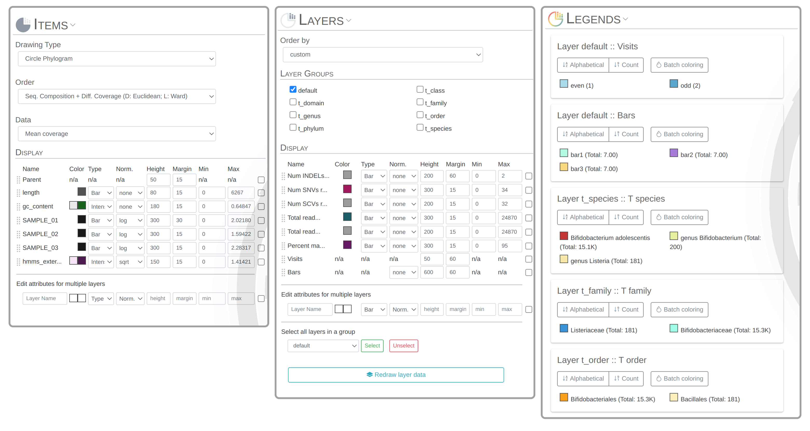
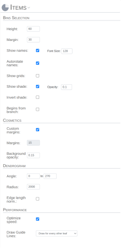
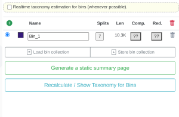
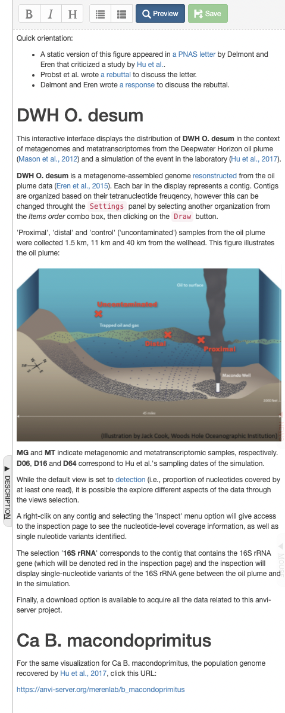

This page describes general properties of anvi'o interactive displays and programs that offer anvi'o interactive artifacts.

## Terminology

Anvi'o uses a simple terminology to address various aspects of interactive displays it produces, such as items, layers, views, orders, and so on. The purpose of this section is to provide some insights into these terminology using the figure below:

{:.center-img}

Even though the figure is a product of %(anvi-display-pan)s, the general terminology does not change across different interfaces, including the default visualizations of %(anvi-interactive)s. Here are the descriptions of numbered areas in the figure:

* The tree denoted by **(1)** shows the organization of each `item`. Items could be contigs, gene clusters, bins, genes, or anything else depending on which mode the anvi'o interactive interface was initiated. The structure that orders items and denoted by **(1)** in the figure can be a phylogenetic or phylogenomic tree, or a dendrogram produced by a hierarchical clustering algorithm. In addition, there may be nothing there, if the user has requested or set a linear items order through %(misc-data-items-order)s.
* Each concentric circle underneath the number **(2)** is called a `layer` and the data shown for items and layers as a whole is called a `view`. A **layer** can be a genome, a metagenome, or anything else depending on which mode the anvi'o interactive was initiated. The **view** is like a data table where a datum is set for each **item** in each **layer**. The view data is typically computed by anvi’o and stored in pan databases by %(anvi-pan-genome)s or profile databases by %(anvi-profile)s. The user add another view to the relevant combo box in the interface by providing a TAB-delimited file to %(anvi-interactive)s through the command line argument `--additional-view`, or add new layers to extend these vies with additional data through %(misc-data-items)s.
* The tree denoted by **(3)** shows a specific ordering of layers. Anvi'o will compute various layer orders automatically based on available **view** depending on the analysis or visualization mode, and users can extend available **layer orders** through %(misc-data-layer-orders)s.
* What is shown by **(4)** is the additional data for layers. the user can extend this section with additional information on layers using the %(misc-data-layers)s.

The orchestrated use of %(anvi-import-misc-data)s, %(anvi-export-misc-data)s, and %(anvi-delete-misc-data)s provides a powerful framework to decorate items or layers in a display and enhance visualization of complex data. Please take a look at the following article on how to extend anvi'o displays:

* [https://merenlab.org/2017/12/11/additional-data-tables/](https://merenlab.org/2017/12/11/additional-data-tables/)

## Programs that give interactive access

If you're new to the anvi'o interactive interface, you'll probably want to check out [this tutorial for beginners](http://merenlab.org/tutorials/interactive-interface/) or the other resources on the  %(anvi-interactive)s page.

However, there are more interfaces available in anvi'o than just that one, so let's list them out:

- %(anvi-display-structure)s lets you examine specific protein structures, along with SCV and SAAVs within it. (It even has [its own software page.](http://merenlab.org/software/anvio-structure/). It's kind of a big deal.)

- %(anvi-display-contigs-stats)s shows you various stats about the contigs within a %(contigs-db)s, such as their hmm-hits, lengths, N and L statistics, and so on.

- %(anvi-display-functions)s lets you quickly browse the functional pool for a given set of genomes or metagenomes.

- %(anvi-display-metabolism)s is still under development but will allow you to interactively view metabolism estimation data using %(anvi-estimate-metabolism)s under the hood.

- %(anvi-display-pan)s displays information about the gene clusters that are stored in a %(pan-db)s. It lets you easily view your core and accessory genes, and can even be turned into a metapangenome through importing additional data tables.

- %(anvi-inspect)s lets you look at a single split across your samples, as well as the genes identified within it. This interface can also be opened from the %(anvi-interactive)s interface by asking for details about a specific split.

- %(anvi-interactive)s displays the information in a %(profile-db)s. It lets you view the distribution of your contigs across your samples, manually bin metagenomic data into MAGSs (and refine those bins with %(anvi-refine)s), and much more. You can also use this to look at your genes instead of your contigs or [examine the genomes after a phylogenomic analysis](http://merenlab.org/2017/06/07/phylogenomics/). Just look at that program page for a glimpse of this program's amazingness.

- %(anvi-script-snvs-to-interactive)s lets you view a comprehensive summary of the SNVs, SCVs, and SAAVs within your contigs.

## Artifacts that give interactive access

- %(gene-cluster-inspection)s lets you examine specific gene clusters.

- %(contig-inspection)s shows you detailed contig information.

## An overview of the display

The interactive interface has two major areas of interaction:

* The space for visualization in the middle area,
* The Settings panel on the left of the screen,

We will spend most of our time in the 'Settings' panel.

### Settings panel

If closed, the settings panel can be opened by clicking on the little button on the left-middle part of your browser. When opened, you will see multiple tabs:

But before we start talking about these tabs, it is worthwhile to mention that at the bottom of the settings panel you will find a section with tiny controls that are available in all tabs:

Through these controls you can,

* __Create or refresh__ the display when necessary using the <ins>D</ins>raw button (or just press <ins>D</ins>),

* __Load or Save__ the current state of the display using the buttons below the State section,

* __Download your display as an SVG file__ (or just press <ins>E</ins>),

* __Center__ the display.

💡  Before talking about Tabs, here's a <ins> useful tip</ins>: you can conveniently switch between tabs using your keypad. For instance, pressing '1' will navigate you to the Main tab, '2' to the Options tab, and so forth.

For more tips you can check out the [Tips + Tricks](#interactive-interface-tips--tricks) section at the end of this page.

OK. Let's talk about each tab you will find in the settings panel.

### Main Tab

This is one of the most frequently used tabs in the interface, and there are multiple sections in it (keeps growing over time, so things may be missing here).

{:.center-img}

- #### Items subsection
  - Provides high level options for adjusting _drawing type_, _items order_ and _data type_.
  - Display part of the interface is where you can adjust individual layer attributes like _color_, display _type_, _height_  and _min/max_ values. Click + drag each layer to rearrange how layers are ordered. Or _edit attributes for multiple lpngayers_ as well.

- #### Layers subsection
  - __Change general settings for the tree__ (i.e., switching between circle or rectengular displays, changing tree radius or width), __and layers__ (i.e., editing layer margins, or activating custom layer margins).
  - __Load or save states__ to store all visual settings, or load a previously saved state.
  - Display usage is same as Items subsection.
  - Change the order of layers using automatically-generated or user-provided orders of layers using the Sample order combo box.
  - Customize individual samples information entries. Changes in this tab can be reflected to the current display without re-drawing the entire tree unless the sample order is changed.

- #### Legends subsection
  - This subsection enables users to easily change individual or batch legend colors for any of their additional data items.d

### Options tab

In the Options tab, just like in the Main tab, we have two sections: Items and Layers, providing a separation for these components.,

{:.center-img}

* **Bins Selection subsection**. Allows us to customize the bins.
* **Cosmetics subsection**. _Margin and Background Opacity_ adjustments on the chart.
* **Dendrogram subsection**. _Radius_ and _Angle_ , and _Edge length normalization_ adjustments for the dendrogram.
* **Branch support subsection**. Settings for displaying _bootstrap values_ on the dendrogram.
* **Selections subsection**. To adjust _height_, _grid_ and/or _shade_ display, as well as selection _name_ settings.
* **Performance subsection**. Whether the SVG output is optimized for performance or granularity (very advanced stuff).

{:.center-img}

* **Tree/Dendogram subsection**. _Height and Edge length normalization_ adjustments on the Tree.
* **Label subsection**. Settings for maximum font size on the Layer.

Mastering these in the Options Tab will minimize the post-processing of your anvi'o figures for high-quality and good-looking publication ready images.

### Bins tab

Anvi’o allows you to create selections of items shown in the display (whether they are contigs, gene clusters, or any other type of data shown in the display). Bins tab allow you to maintain these selections. Any selection on the tree will be added to active bin in this tab (the state radio button next to a bin defines its activity). Through this tab you can,

{:.center-img}

- __Create or delete bins, set bin names, change the color of a given bin__, or sort bins based on their name, the number of units they carry, or completion and contamination estimates (completion / contamination estimates are only computed for genomic or metagenomic analyses).

- View the __number of selected units__ in a given bin, and see the __list of names in the selection__ by clicking the button that shows the number of units described in the bin.

- __Store a collection of bins__, or __load a previously stored collection.__

### Data tab

The data tab displays the value of items underneath the mouse pointer while the user browse the tree.

Displaying the numerical or categorical value of an item shown on the tree is not an easy task. We originally thought that displaying pop-up windows would solve it, but besides the great overhead, it often became a nuisance while browsing parts of the tree. We could show those pop-up displays only when use clicks on the tree, however click-behavior is much more appropriate to add or remove individual items from a bin, hence, it wasn’t the best solution either. So we came up with the ‘data tab’. You have a better idea? I am not surprised! We would love to try improve your experience: please enter an issue, and let’s discuss.

### Search tab

It does what the name suggests. Using this tab you can,

- __Build expressions to search items__ visualized in the main display.

- __Highlight matches__, and __append__ them to, or __remove__ them from the __selected bin__ in the Bins tab.

### News tab

The news panel provides information and external links tracking major Anvi'o releases and development updates.

### Notes tab

- The notes tab is a flexible, multipurpose space where users can,
- Store notes, comments, and any other stray items related to their project, in a feature-rich markdown environment.
- Display context, references, reproducibility instructions, and any other salient details for published figures.
- This section moved under Settings panel. `Settings > Notes`

{:.center-img}

## Interactive interface tips + tricks

Here are some small conveniences that may help the interface serve you better (we are happy to expand these little tricks with your suggestions).

* You can zoom to a section of the display by making a rectangular selection of the area __while the pressing the shift button.__

* You can click an entire branch to add items into the selected bin, and remove them by __right-clicking__ a branch.

* If you click a branch __while pressing the `Command` or `CTRL` button__, it will create a new bin, and add the content of the selection into that bin.

* Tired of selecting items for binning one by one? __right-click__ on an item and select __Mark item as 'range start'__ to set an 'in point', then __right-click__ on another item and select __Add items in range to active bin__ or __Remove items in range from any bin__ to manipulate many items with few clicks. Nice!

* By pressing `1`,`2`,`3`,`4`,`5`,`6`,`7` and `8` you can go between Main, Options, Bins, Data, Notes, Search, News and Anvi'o tabs!

## Keyboard shortcuts

The interactive interface recognizes a handful of keyboard shortcuts to help speed up your workflow

- The `S` key toggles the Settings panel
- The `D` key triggers a redraw of your visualization
- The `T` key toggles showing the Title panel
- Keys `1` through `8` will toggle between tabs within the Settings panel, granted the Settings panel is currently shown.
- `CTRL`+`Z` and `CTRL`+`SHIFT`+`Z` will undo or redo bin actions, respectively.

