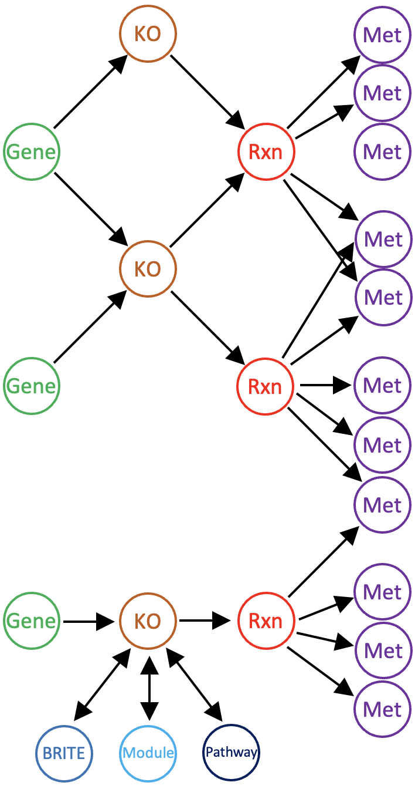

This artifact represents the metabolic reaction network, which can be stored in a %(contigs-db)s or a %(pan-db)s by %(anvi-reaction-network)s.

Reaction networks enable investigations of biochemical pathways at the molecular level, protein and metabolite abundances, and the relation of these to genomic data stored in anvi'o databases. Networks can be exported as a file formatted for compatibility with metabolic modeling packages such as COBRApy: see %(anvi-get-metabolic-model-file).

## Network structure

The biochemical reactions used to construct a network are derived from [KEGG protein ortholog (KO)](https://www.genome.jp/kegg/ko.html) annotations of genes. Many KOs reference [KEGG REACTION IDs](https://www.genome.jp/kegg/reaction/) and [Enzyme Commission (EC) numbers](https://www.enzyme-database.org/class.php). These reaction accessions are in turn related to the [ModelSEED Biochemistry database](https://github.com/ModelSEED/ModelSEEDDatabase) to retrieve standardized data on reaction properties. The network's representation of metabolism is subject to all the limitations of these references, including missing protein annotations of genes and imprecise knowledge of the reactions catalyzed by enzymes. The creation of a functional flux balance model from the draft model represented by the network requires manual curation, including gap-filling of missing reactions.

A reaction network has the following structure. There are four types of nodes representing genes (or gene clusters in a pangenomic network), KOs, (ModelSEED) reactions, and metabolites (ModelSEED compounds). When the network is constructed, only gene KO annotations with stoichiometrically defined reactions are included. Each gene node references one or more KO nodes (each gene cluster node references only one KO node); KO nodes reference one or more reaction nodes; reaction nodes reference the metabolite nodes defining the reaction. The network stores a variety of information, including: KEGG Reaction and EC number aliases of the ModelSEED reactions; the strength of gene-KO annotations (e-values); reaction stoichiometry, reversibility, and substrate compartmentalization ("cytosolic" or "extracellular") according to the ModelSEED database; and compound formulae and charges according to the ModelSEED database.

Protein and metabolite abundance data can be imported into a reaction network, enabling analysis of proteomics and metabolomics data in the context of biochemical pathways. %(anvi-import-protein-profile)s and %(anvi-import-metabolite-profile)s load abundance data into the network from tab-delimited files. New nodes are added to the network for each protein with abundance data; metabolite abundances are assigned to metabolite nodes already in the network. Protein and gene nodes reference each other, and each gene is currently only allowed to express a single protein.
